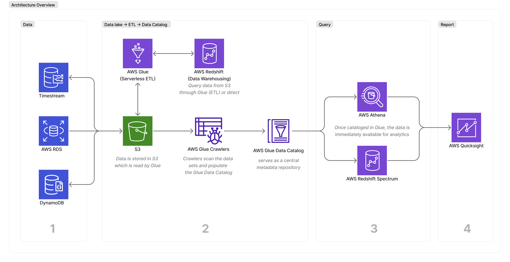

# AWS Serverlesss Analytics Architecture

**Technologies** 
AWS Athena, Glue, Quicksight, and Redshift Spectrum

# Table of Contents
- [AWS Serverlesss Analytics Architecture](#aws-serverlesss-analytics-architecture)
- [Table of Contents](#table-of-contents)
  - [Ecosystem Overview](#ecosystem-overview)
  - [Architectural Overview](#architectural-overview)
  - [Data](#data)
  - [Technologies](#technologies)
    - [AWS Glue](#aws-glue)
  - [Practical Guide](#practical-guide)
    - [Sources](#sources)

## Ecosystem Overview
**How does data go from source to reporting?** 
1. Data from web logs, clickstream, sensors, etc. is uploaded to S3 (data lake). 
2. Build a data catalog from the S3 data (i.e. transforming data, ETL).
3. Query the data using a query engine (Athena, Elasticsearch, RedShift, etc.)
4. Report to the enduser using Quicksight, Notebooks, or an API Gateway for programmatic access. 
  

## Architectural Overview
Interoperating a data lake and a data warehouse. 

## Data
Date comes from multiple sources and formats: 

## Technologies
### AWS Glue
* Automatically discover and categorize the data making it immediately searchable and queryable across data sources. 
* Generate code to clean, enrich, and reliably move data between various data sources. 
* Run jobs on a serverless, fully managed environment.
* Components:
  * Data Catalog: central data repository integrated with aws services.
  * Job authoring: auto-generate ETL code, edit, and debug. 
  * Deploy: serverless execution, scheduling, monitoring, and alerting. 

What is AWS Glue used for? 
* You can use AWS Glue to understand the data assets. You can store the data using various AWS services and still maintain a unified view of the data using AWS Glue Data Catalog. 
* View the Data Catalog to quickly search and discover data accross various data sources. 

Move data across storage systems:

> Glue is a middleware (ETL Layer) between data source and 
> query/reporting tools like AWS Athena and Quicksight.

:warning: Each AWS account has one AWS Data Catalog.

## Practical Guide

1. Create S3 Bucket (TODO)
2. [Create AWS Redshift Cluster](./docs/create-redshift-cluster.md)   
3. [Setup AWS Glue](./docs/create-glue.md)

### Sources

* [What is AWS Glue?](https://docs.aws.amazon.com/glue/latest/dg/what-is-glue.html)
* [Data Catalog and crawlers in AWS Glue](https://docs.aws.amazon.com/glue/latest/dg/catalog-and-crawler.html)