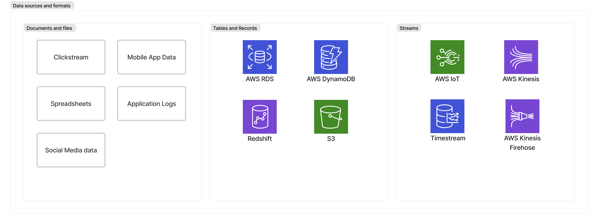

# AWS Serverlesss Analytics Architecture

**Technologies** 
AWS Athena, Glue, Quicksight, and Redshift Spectrum

## Table of Contents
- [AWS Serverlesss Analytics Architecture](#aws-serverlesss-analytics-architecture)
  - [Table of Contents](#table-of-contents)
    - [Ecosystem Overview](#ecosystem-overview)
    - [Architectural Overview](#architectural-overview)
    - [Data](#data)

### Ecosystem Overview
**How does data go from source to reporting?** 
1. Data from web logs, clickstream, sensors, etc. is uploaded to S3 (data lake). 
2. Build a data catalog from the S3 data (i.e. transforming data, ETL).
3. Query the data using a query engine (Athena, Elasticsearch, RedShift, etc.)
4. Report to the enduser using Quicksight, Notebooks, or an API Gateway for programmatic access. 
  

### Architectural Overview
Interoperating a data lake and a data warehouse. 

### Data
Date comes from multiple sources and formats: 

