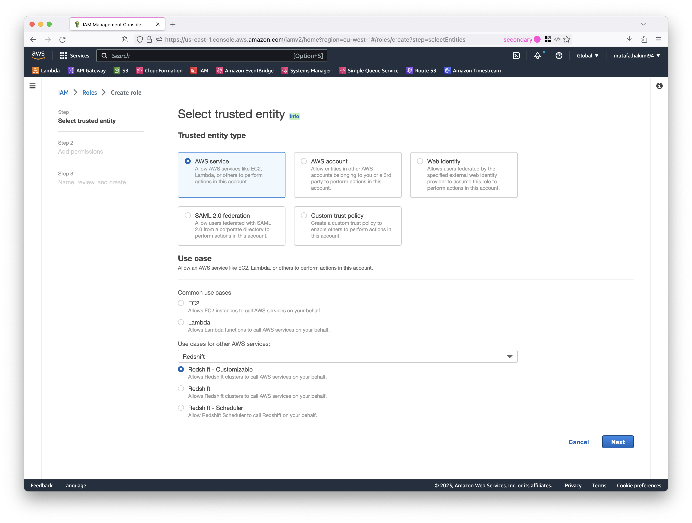
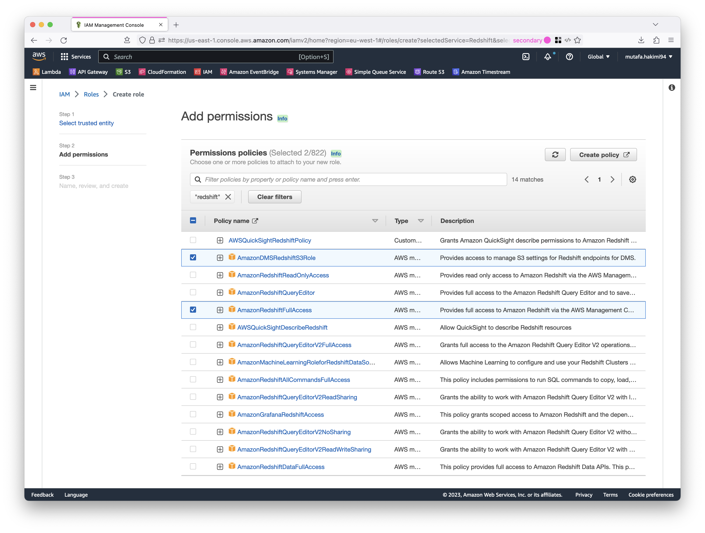
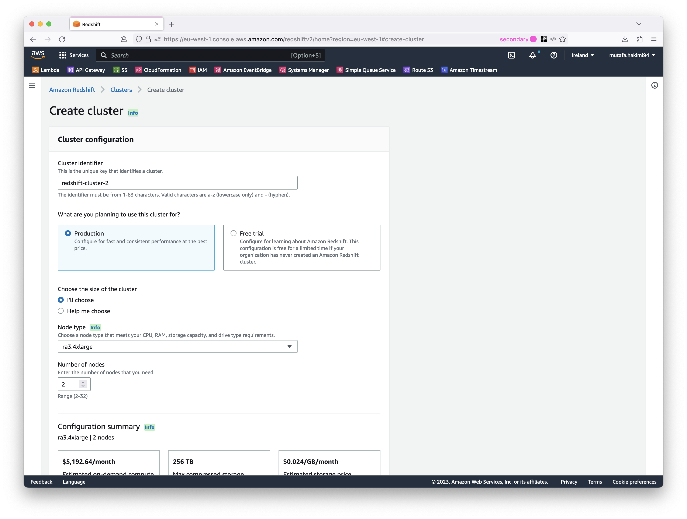
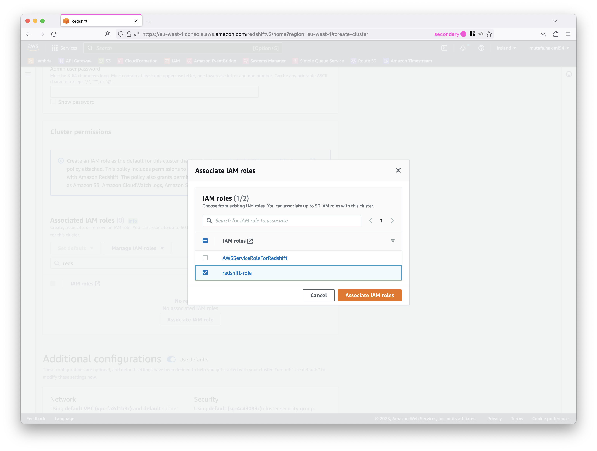
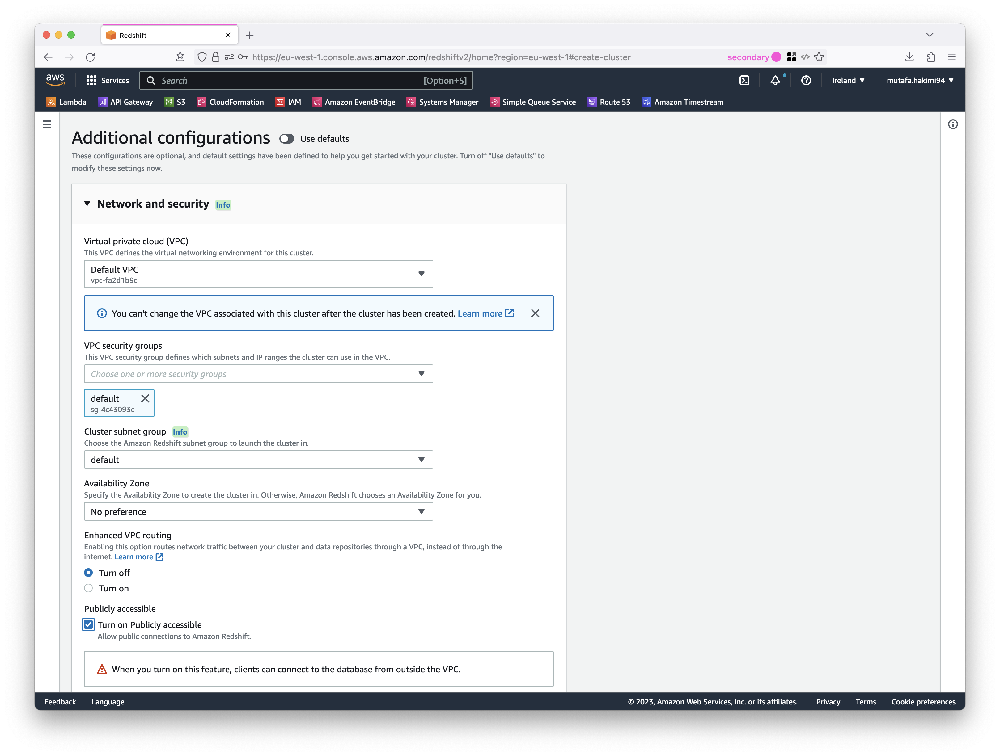
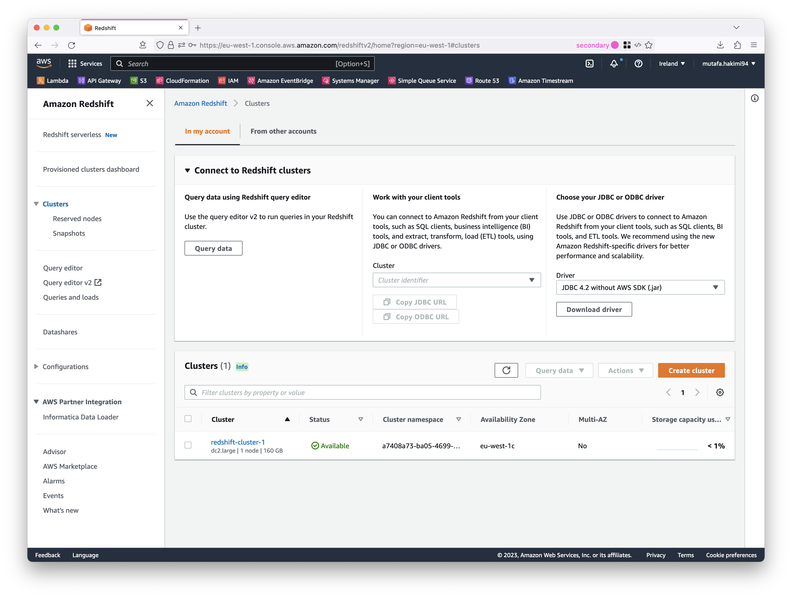
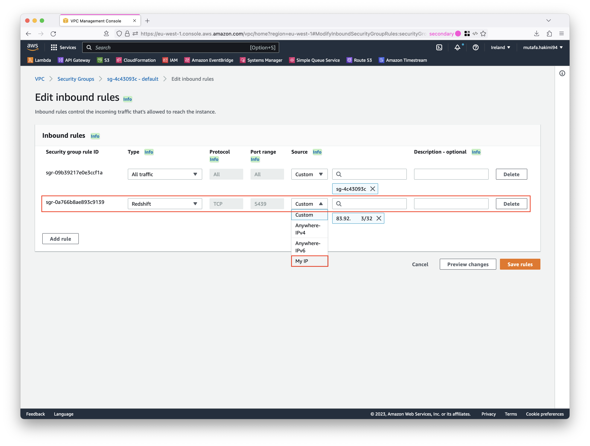
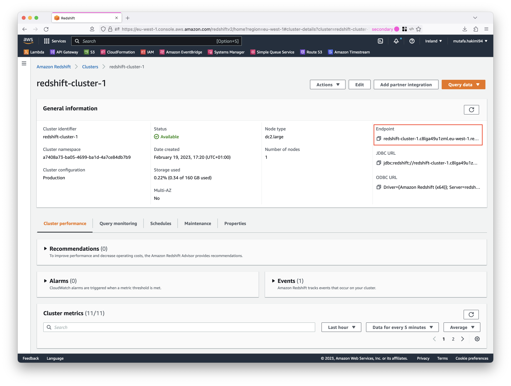
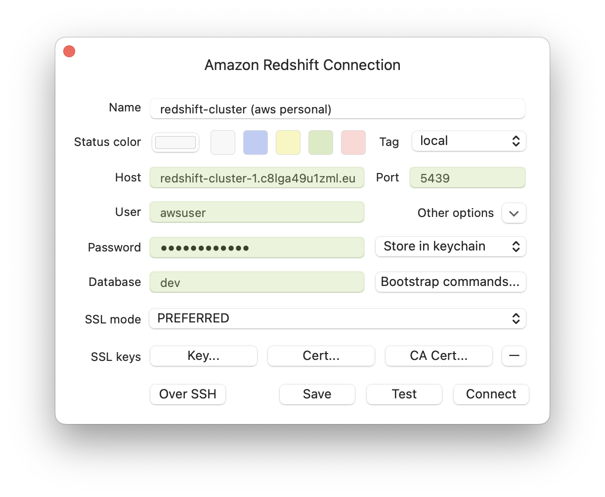
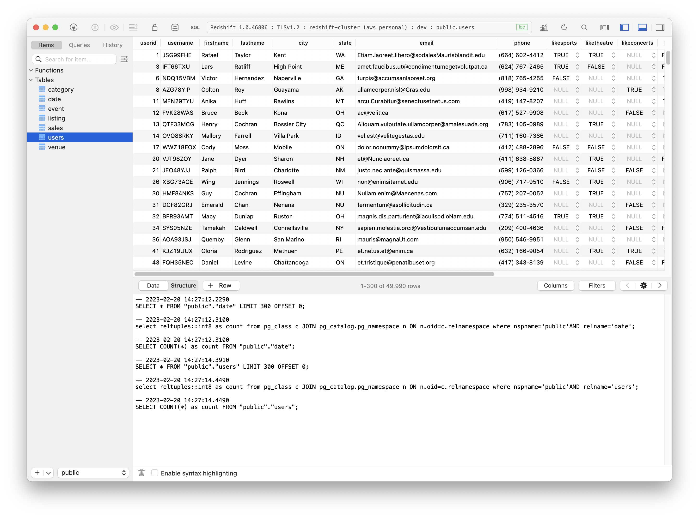

# Create Redshift Cluster

## Steps
- [Create Redshift Cluster](#create-redshift-cluster)
  - [Steps](#steps)
    - [1. Create IAM role for redshift](#1-create-iam-role-for-redshift)
    - [2. Create Redshift Cluster](#2-create-redshift-cluster)
    - [3. Configure Redshift inbound rule](#3-configure-redshift-inbound-rule)
    - [4. Connect to Redshift using a local client](#4-connect-to-redshift-using-a-local-client)

### 1. Create IAM role for redshift

Create an IAM role with the following permissions 
```shell
AmazonDMSRedshiftS3Role
AmazonRedshiftFullAccess
```




### 2. Create Redshift Cluster

Create a Redshift Cluster with the default configurations but change the network and security configuration to allow public access. This allows public connections to Amazon Redshift from a local database client. Also associate the Redshift IAM role (from previous step)





### 3. Configure Redshift inbound rule

The Redshift Cluster should be up and running at this point. 


Navigate to the Security Group that is connected to the Redshift Cluster and create a new inbound rule for Redshift on port `5439` (default) and the local IP address.



### 4. Connect to Redshift using a local client

Use the Redshift endpoint URL and the database credentials (username and password) that were given during the creation of the cluster. 



Input fields
```shell
Host: <redshift-endpoint-url>
Port: 5439
User: <custom>
Password: <custom>
Database: dev (created by default)
```


